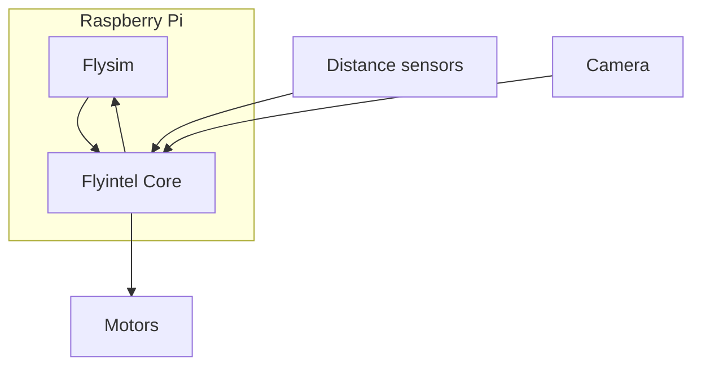

[Github](https://github.com/gogoalexy/FlyintelBot)

Flyintel was kicked off as a fun project aiming to integrate spiking neural networks (SNN) with 
an autonomous vehicle. The key to the project is that all the decisions the robot makes are made by 
bio-inspired SNNs. The SNN simulator used here is Flysim, an in-house developed fast and 
lightweight simulator. 

## Tech Stack
* Programming language: The whole project is deployed on a Raspberry Pi and controlled by a C++ 
software
* 3D printing and design: The frames of the sensors and the experiment arena are designed in 
FreeCAD. 
* Neural network: Two bio-inspired SNNs that resemble fruit fly behavior.

## Results

### FlyintelBot

### Experiment
The following video showcases the full navigation experiment. There are three stages in the 
experiment:
1. The robot roams inside the arena. The spatial memory network is disengaged at this stage.
2. Form spatial memory
3. The robot heads back to the landmark based on its spatial memory.
 


## Acknowledgements
1. [Yu-Chi Huang](https://github.com/yc-h) developed our in-house SNN simulator 
[Flysim](https://github.com/yc-h/flysim).

## References
1. H. Yao, H. Huang, Y. Huang, and C. Lo, “Flyintel – a Platform for Robot Navigation based on a 
Brain-Inspired Spiking Neural Network,” in 2019 IEEE International Conference on Artificial 
Intelligence Circuits and Systems (AICAS), Mar. 2019, pp. 219–220, 
doi: [10.1109/AICAS.2019.8771614](https://ieeexplore.ieee.org/document/8771614).
